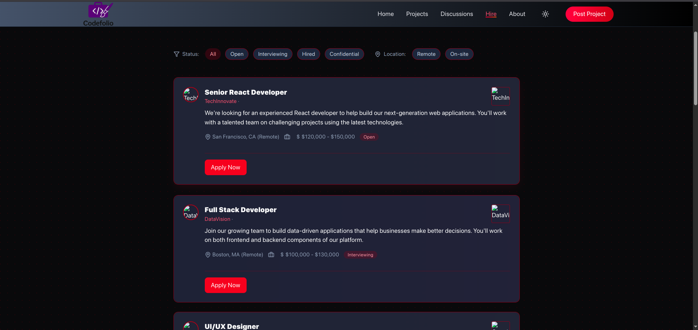

# Modern Job Board Application

A modern, responsive job board application built with Next.js, React, and Tailwind CSS. Features real-time filtering, smooth animations, and a dark mode interface.

## 🌟 Features

- 🔍 Real-time search and filtering
- 🌓 Dark/Light mode support
- ✨ Smooth animations using Framer Motion
- 📱 Fully responsive design
- 🏷️ Multiple filter options (Remote, On-site, Status)
- 💼 Detailed job listings with company information
- 🎯 Advanced job status tracking

## 🖼️ Screenshots

### Home Page

*The main job listings page with search and filters*

### Discussion Section

*Active filters showing remote jobs*

### Job Details

*Detailed view of a job listing*


## 🚀 Getting Started

### Prerequisites

- Node.js 14.0 or later
- npm or yarn

### Installation

1. Clone the repository:
```bash
git clone https://github.com/yourusername/job-board.git
```

2. Install dependencies:
```bash
cd job-board
npm install
# or
yarn install
```

3. Start the development server:
```bash
npm run dev
# or
yarn dev
```

4. Open [http://localhost:5173](http://localhost:3000) in your browser

## 🛠️ Built With

- [Next.js](https://nextjs.org/) - React framework
- [Tailwind CSS](https://tailwindcss.com/) - Styling
- [Framer Motion](https://www.framer.com/motion/) - Animations
- [Lucide React](https://lucide.dev/) - Icons

## 📁 Project Structure

## Expanding the ESLint configuration

If you are developing a production application, we recommend updating the configuration to enable type-aware lint rules:

```js
export default tseslint.config({
  extends: [
    // Remove ...tseslint.configs.recommended and replace with this
    ...tseslint.configs.recommendedTypeChecked,
    // Alternatively, use this for stricter rules
    ...tseslint.configs.strictTypeChecked,
    // Optionally, add this for stylistic rules
    ...tseslint.configs.stylisticTypeChecked,
  ],
  languageOptions: {
    // other options...
    parserOptions: {
      project: ['./tsconfig.node.json', './tsconfig.app.json'],
      tsconfigRootDir: import.meta.dirname,
    },
  },
})
```

You can also install [eslint-plugin-react-x](https://github.com/Rel1cx/eslint-react/tree/main/packages/plugins/eslint-plugin-react-x) and [eslint-plugin-react-dom](https://github.com/Rel1cx/eslint-react/tree/main/packages/plugins/eslint-plugin-react-dom) for React-specific lint rules:

```js
// eslint.config.js
import reactX from 'eslint-plugin-react-x'
import reactDom from 'eslint-plugin-react-dom'

export default tseslint.config({
  plugins: {
    // Add the react-x and react-dom plugins
    'react-x': reactX,
    'react-dom': reactDom,
  },
  rules: {
    // other rules...
    // Enable its recommended typescript rules
    ...reactX.configs['recommended-typescript'].rules,
    ...reactDom.configs.recommended.rules,
  },
})
```

## 🎨 Key Features Explained

### Real-time Search
The application features a real-time search functionality that filters jobs based on:
- Job title
- Company name
- Description
- Location

### Filter System
Users can filter jobs by:
- Status (Open, Interviewing, Hired, Confidential)
- Location type (Remote, On-site)
- Multiple filters can be combined

### Responsive Design
- Mobile-first approach
- Adapts to all screen sizes
- Optimized for both touch and mouse interactions

## 🔧 Configuration

### Image Handling
To properly handle company logos, ensure your `next.config.js` includes:

```javascript
module.exports = {
  images: {
    domains: ['images.unsplash.com'], // Add other image domains as needed
  },
}
```

### Environment Variables
Create a `.env.local` file:

```env
NEXT_PUBLIC_API_URL=your_api_url_here
```

## 📝 To-Do List

- [ ] Add authentication system
- [ ] Implement job application tracking
- [ ] Add email notifications
- [ ] Integrate with external job APIs
- [ ] Add company profiles

## 🤝 Contributing

1. Fork the repository
2. Create your feature branch (`git checkout -b feature/AmazingFeature`)
3. Commit your changes (`git commit -m 'Add some AmazingFeature'`)
4. Push to the branch (`git push origin feature/AmazingFeature`)
5. Open a Pull Request

## 📜 License

This project is licensed under the MIT License - see the [LICENSE.md](LICENSE.md) file for details

## 👏 Acknowledgments

- Design inspired by modern job boards
- Icons provided by Lucide React
- Background patterns from Tailwind CSS

## 📞 Contact

Your Name - [@yourtwitter](https://twitter.com/yourtwitter)
Project Link: [https://github.com/yourusername/job-board](https://github.com/yourusername/job-board)
